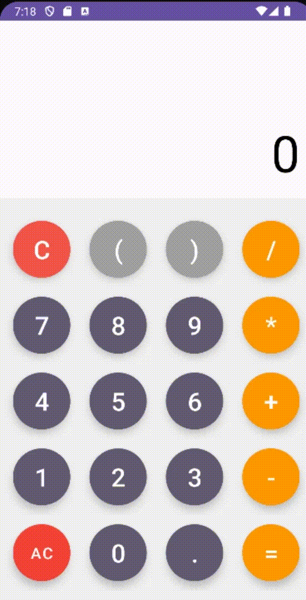

Language : us | [ru](./README.ru-RU.md)

## Calculator
This is a `fully working calculator`! The calculator was created in the `Android Studo` program, has a beautiful design and even a function for adding brackets

 

 ## Compatibility

> The calculator was created in Android Studio and unfortunately `it cannot be used in Apple phones`

| </br>Android | </br>Apple |
:-------:|:-------:|
|    ✔️  |    ❌  |

<h1 align="center">Important code moments</h1> 

The whole complexity of the code was contained in the `Clear` button

```
private void calculateResult() {
        try {
            String input = inputStringBuilder.toString();
            Expression expression = new ExpressionBuilder(input).build();
            double result = (int)expression.evaluate();
            resultTextView.setText(String.valueOf(result));

        } catch (Exception e) {
            resultTextView.setText("Error");
        }
    }
```
In order to create this button, I needed to connect `Expression Builder` to the project
